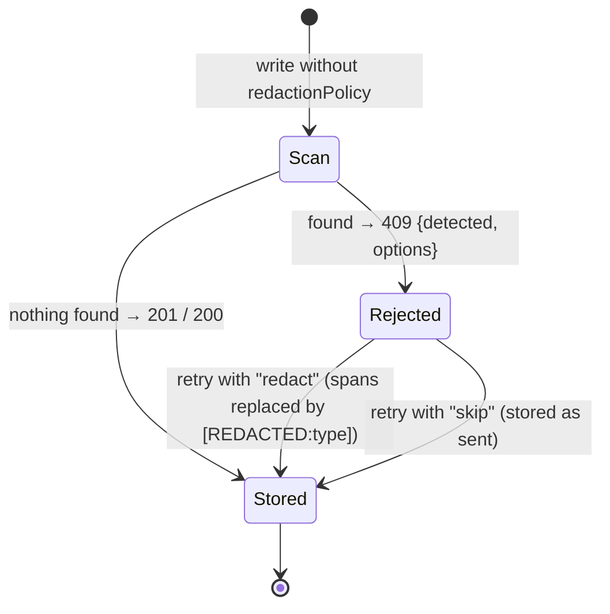

# REST API

All routes are served by `agentdocstore serve` (default
`http://127.0.0.1:8787`). Request and response bodies are JSON unless noted.
Every route authenticates the caller with the server's auth mode — see
[CONFIGURATION.md](CONFIGURATION.md#authentication).

## Conventions

- **Ids** are 10-character nanoids (`A–Z a–z 0–9 _ -`). A malformed id is a
  `400`, never a lookup.
- **Visibility.** A `PRIVATE` document you do not own behaves exactly like a document that
  does not exist: `404` on every route.
- **Errors** have the shape `{ "error": "<message>" }`. When a request body fails
  validation, the message names the field and why, for example
  `Invalid request body: visibility: must be one of PUBLIC, PRIVATE`. The
  rejected value itself is never repeated back.

| Status | Meaning                                                  |
| ------ | -------------------------------------------------------- |
| `400`  | Validation failed (schema, id, version number, language) |
| `401`  | The auth mode could not identify the caller              |
| `404`  | Not found — or not visible to you                        |
| `409`  | Credentials detected (see below), or a version conflict  |
| `413`  | Request body or content over the limit                   |
| `503`  | `/healthz` only — the provider reports itself unhealthy  |

## Limits

| Limit               | Value         |
| ------------------- | ------------- |
| Content per version | 5 MiB (UTF-8) |
| Title               | 300 bytes     |
| Comment body        | 10,000 bytes  |
| Each side of a diff | 2 MiB         |

## The credential-scan handshake

`POST /api/documents` and `PUT /api/documents/:id` scan content unless the request says
how to treat credentials.



Detected types: `pem-private-key`, `aws-access-key`, `aws-secret-key`, `jwt`,
`bearer-token`, `github-token`, `gitlab-token`, `slack-token`,
`connection-string-password`, `generic-secret`.

## Documents

### `POST /api/documents` — create

```json
{
  "title": "Release notes",
  "content": "# v1.2\n…",
  "language": "markdown",
  "visibility": "PRIVATE",
  "expiresInDays": 30,
  "redactionPolicy": "redact"
}
```

| Field             | Type                    | Required | Default     |
| ----------------- | ----------------------- | :------: | ----------- |
| `title`           | string (non-empty)      |    ✅    |             |
| `content`         | string                  |    ✅    |             |
| `language`        | one of the 18 languages |          | `plaintext` |
| `visibility`      | `PUBLIC` \| `PRIVATE`   |          | `PUBLIC`    |
| `expiresInDays`   | positive integer        |          | never       |
| `redactionPolicy` | `redact` \| `skip`      |          | scan first  |

`201` returns the document record:

```json
{
  "id": "tYg8rdeDqs",
  "title": "Release notes",
  "language": "markdown",
  "visibility": "PRIVATE",
  "createdBy": "alice",
  "createdAt": "2026-09-26T14:07:13.658Z",
  "updatedAt": "2026-09-26T14:07:13.658Z",
  "latestVersion": 1
}
```

Languages: `markdown`, `mermaid`, `plaintext`, `text`, `javascript`,
`typescript`, `python`, `java`, `go`, `rust`, `json`, `yaml`, `xml`, `html`,
`css`, `sql`, `bash`, `dockerfile`.

### `GET /api/documents` — list or search

| Query    | Effect                                                                                  |
| -------- | --------------------------------------------------------------------------------------- |
| _(none)_ | Your documents, newest first: `{ items, nextCursor? }`                                  |
| `cursor` | Continue a listing or a search (opaque; pass back `nextCursor` with the same `query`)   |
| `limit`  | Page size, integer 1–100 (default 50); anything else is `400`                           |
| `query`  | Full-text search over your documents and `PUBLIC` ones: `{ items, total, nextCursor? }` |

`total` counts every match, not just this page. A search `cursor` that is not
a `nextCursor` from a search is a `400`.

### `GET /api/documents/:id` — read

Returns the document record plus `content` of the latest version. With
`?version=N`, returns that version's `content` and a `version` field.

### `PUT /api/documents/:id` — update

Any subset of `content`, `title`, `language`, `visibility`, `expiresInDays`
(`null` clears expiry), `redactionPolicy`. Changing `content` appends a new
version; metadata-only changes do not. Only the owner may update.

A `409` means nothing was saved: when credentials are detected, or when another
save of the same document landed first (a version conflict), no field of the
request is applied.

`editMessage` is an optional note about the change (at most 500 characters,
trimmed; a blank note is ignored). It is stored on the new version and returned
as `message` by `GET /api/documents/:id/versions`. It only applies when
`content` changes, since only that creates a version.

### `DELETE /api/documents/:id`

Deletes the document, its versions and its comments. Returns `{ "deleted": true }`.

### `POST /api/documents/:id/visibility`

`{ "visibility": "PUBLIC" | "PRIVATE" }` → the updated document.

## History

### `GET /api/documents/:id/versions`

`{ "versions": [ { "documentId", "version", "content", "createdBy", "createdAt" } ] }`

### `GET /api/documents/:id/diff?from=N&to=M`

`{ "diff": "<unified diff>" }`, with headers `--- vN` and `+++ vM`.

### `GET /raw/:id[?version=N]`

The content as `text/plain`. Same visibility rules as the JSON read.

## Comments

| Method   | Path                               | Body                   | Returns                 |
| -------- | ---------------------------------- | ---------------------- | ----------------------- |
| `POST`   | `/api/documents/:id/comments`      | `{ "body": "…" }`      | `201` the comment       |
| `GET`    | `/api/documents/:id/comments`      |                        | `{ "comments": [ … ] }` |
| `PATCH`  | `/api/documents/:id/comments/:cid` | `{ "resolved": true }` | the comment             |
| `DELETE` | `/api/documents/:id/comments/:cid` |                        | `{ "deleted": true }`   |

A comment: `{ id, documentId, author, body, resolved, createdAt, updatedAt }`.

Only the comment's author or the document's owner can delete a comment. Anyone
else gets `404`, the same answer as for a comment that does not exist.

## Utility

### `POST /api/scan`

`{ "content": "…" }` → `{ "findings": [ { "type", "line", "start", "end" } ] }`.
Nothing is stored.

### `GET /api/whoami`

`{ "user": "alice" }` — useful for checking an auth setup.

### `GET /healthz`

```json
{
  "status": "ok",
  "mode": "offline",
  "provider": {
    "name": "fs",
    "search": "core-fallback",
    "nativeTtl": false,
    "requiresNetwork": false
  }
}
```

If the provider implements `healthCheck()` and reports unhealthy, the status is
`degraded` with HTTP `503` and a `store` field describing why.

## MCP over HTTP

`/mcp` speaks the MCP streamable-HTTP transport and is authenticated the same
way as the routes above. The tools are documented in [MCP.md](MCP.md).
