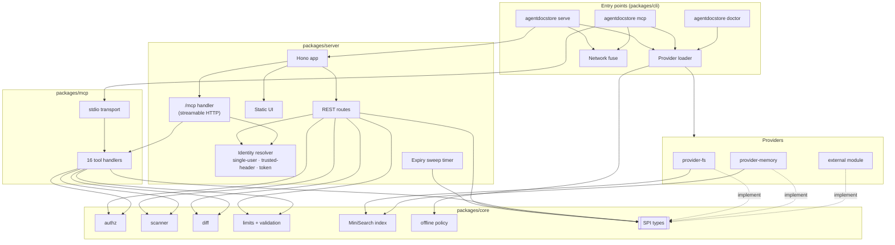
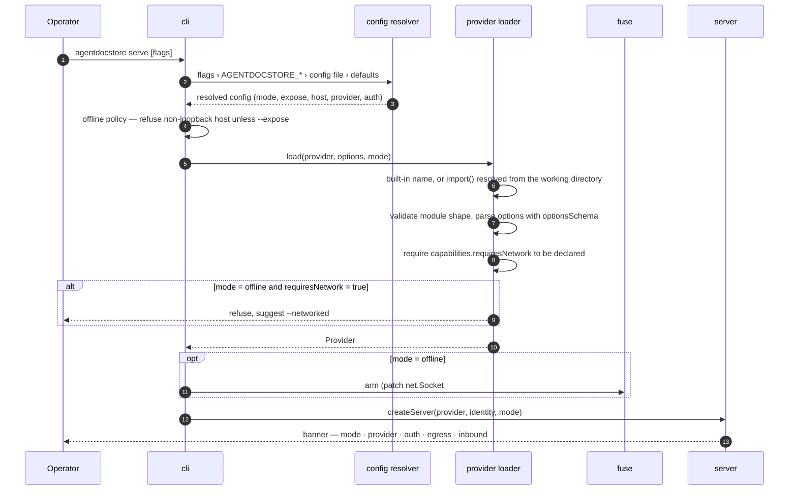
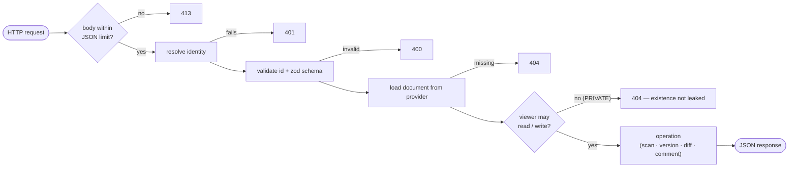
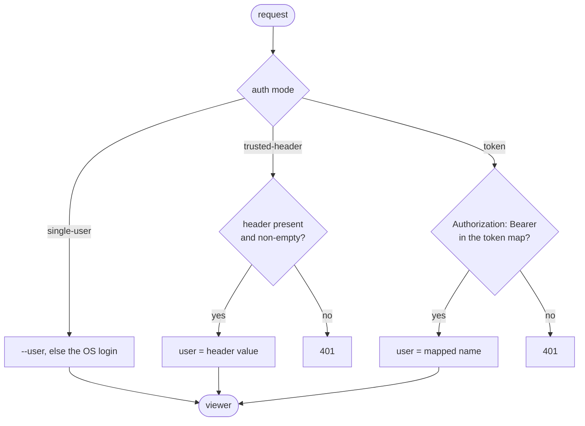
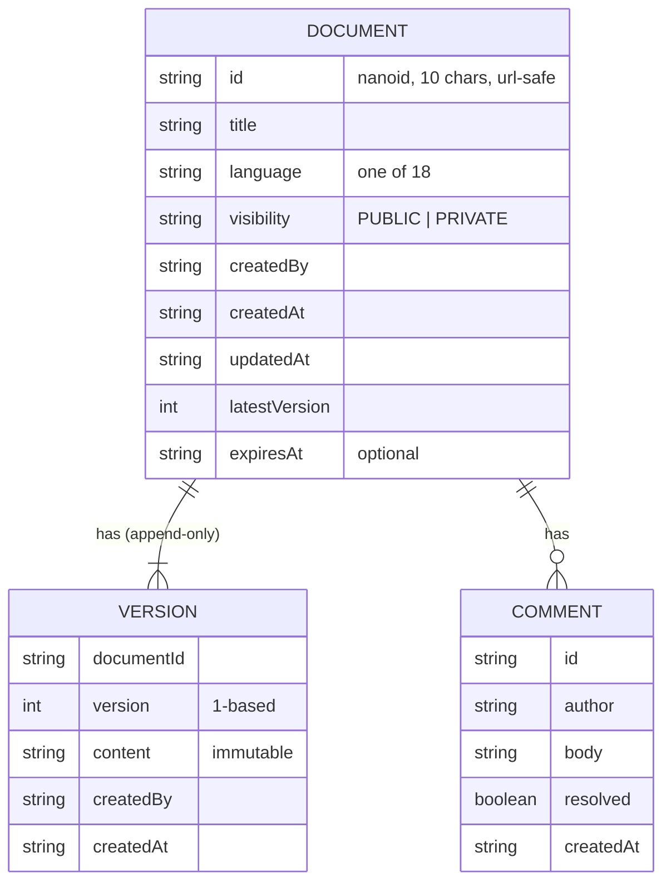
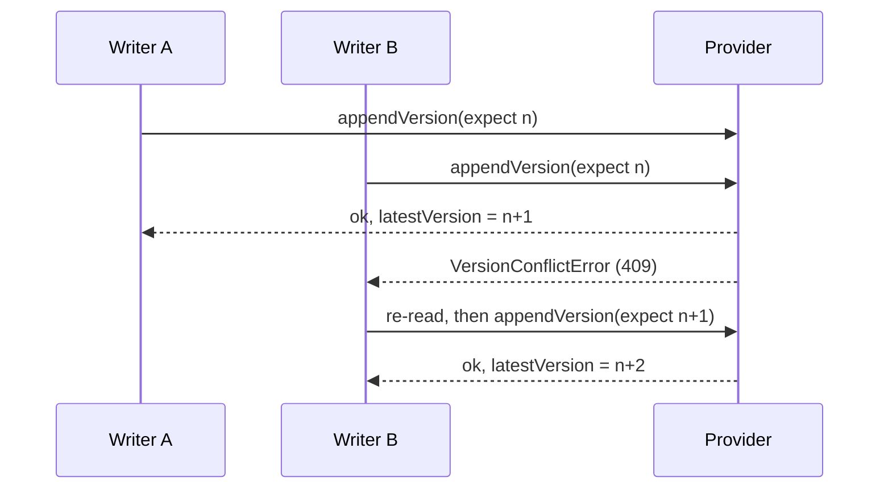
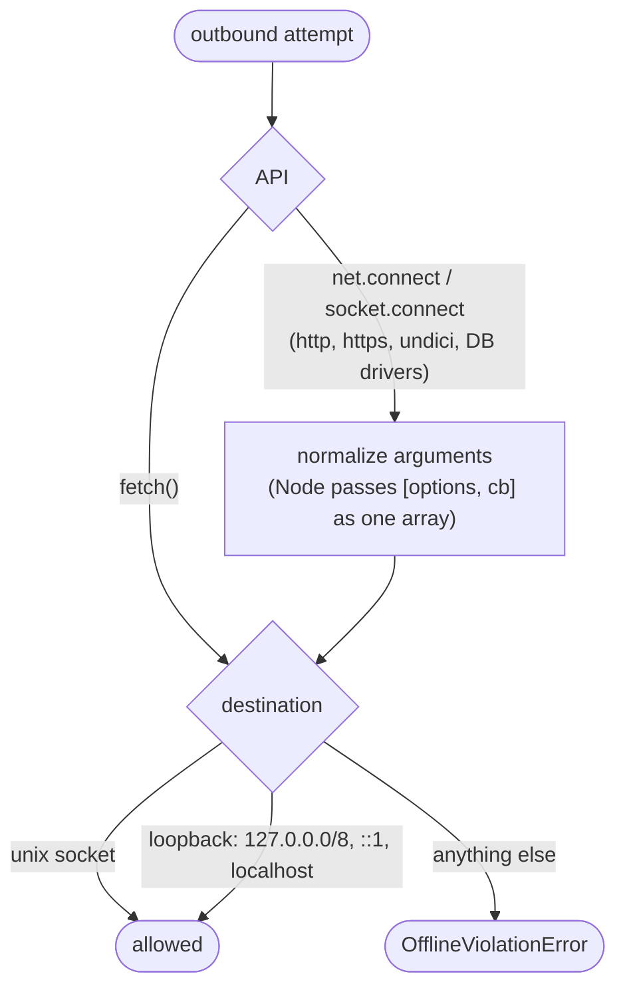

# Architecture

This document explains how AgentDocStore is put together and why. For the
provider contract see [PROVIDERS.md](PROVIDERS.md); for the threat model see
[SECURITY.md](SECURITY.md).

## Design principles

1. **Rules live in one place.** Authorization, validation, size limits,
   credential scanning and diffing are `@agentdocstore/core` functions. REST
   routes and MCP tools are thin adapters that call them, so the two surfaces
   cannot drift apart.
2. **Stores are replaceable.** Everything persistent sits behind the provider
   SPI. The built-in providers get no special access; they pass the same
   conformance suite a third-party store must pass.
3. **Offline is a property of the process, not a promise in the docs.** The
   default mode refuses to bind publicly, refuses network-backed stores, and
   fuses outbound sockets.
4. **Fail loudly and say what to do.** A refused action names the flag or
   setting that would allow it.

## Component view



The `web` package is a separate esbuild bundle. The server only serves its
output; nothing in the server imports frontend code.

## Startup



`agentdocstore mcp` follows the same path but starts the stdio transport instead
of the HTTP server. `agentdocstore doctor` stops after loading and runs its
checks.

## Request lifecycle



Typed errors from core map to status codes in one place:
`ValidationError` → 400, `NotFoundError` → 404, `VersionConflictError` → 409,
`ContentTooLargeError` → 413. Anything else is a 500 with a generic message.

## Identity

Identity is resolved on **every request**, for REST and MCP alike. There is no
fallback user: if the configured mode cannot identify the caller, the request
is rejected.



For `/mcp`, the identity that opens a session is recorded with it. A later
request carrying that `mcp-session-id` must resolve to the same user, or it gets
`403` — a leaked session id is not a login. Because identity is re-resolved per
request, revoking a token takes effect mid-session.

The stdio transport has no requests to authenticate; it acts as the configured
`--user` (default: the OS login), which is the same identity `serve` uses in
single-user mode, so both surfaces see the same documents.

## Data model



Versions are never rewritten. `latestVersion` is the pointer; moving it is the
commit point of a write, which is why providers must persist content before
they update the pointer.

## Concurrency: compare-and-set versioning

Two writers editing the same document both read `latestVersion = n` and both try to
append. The provider accepts the first and rejects the second:



Every provider must implement this check; the conformance suite tests it.
`capabilities.atomicVersioning` is reported by `agentdocstore doctor`, but core
does not currently add its own locking for a store that sets it to `false`.

## provider-fs on disk

```text
<dataDir>/
├── .agentdocstore.lock/          advisory lock — one server per data directory
├── index/
│   └── snapshot.json           persisted search index, rebuilt if missing/corrupt
└── documents/
    └── <id>/
        ├── meta.json           the document record, including latestVersion
        ├── comments.json
        └── versions/
            ├── 1.txt
            └── 2.txt
```

- Every file is written to a temp name and `rename()`d into place, which is
  atomic on one filesystem.
- A per-document mutex serializes writers inside the process; the lock directory
  stops a second process from opening the same data directory.
- Ids are checked against the nanoid alphabet **before** any path is built, so
  a crafted id cannot escape the data directory.

## Search

Search is a MiniSearch index over title and content. Providers that have no
search engine of their own use core's index (`search: 'core-fallback'`); the fs
provider persists it as a snapshot. Visibility is applied inside the query:
a viewer sees their own documents plus `PUBLIC` ones, never someone else's
`PRIVATE` document.

## Expiry

Documents may carry `expiresAt` (set with `expiresInDays`). If the provider declares
`nativeTtl: false`, the server runs a sweep every minute that asks
`listExpired()` for up to 100 due ids and deletes them. Sweep errors are
swallowed — a failing sweep never takes the server down — and the timer is
`unref()`ed so it never keeps the process alive on its own.

## The network fuse



Inbound traffic (`listen()` and accepted sockets) is never affected. The fuse
does not cover `child_process` or raw `dgram`, so it is a guard rail against
accidental egress, not a sandbox against hostile code. The air-gap test
(`scripts/airgap-test.sh`) runs the app under `docker run --network none` and
proves two things: the application works with no network at all, and each
egress attempt is refused **by the fuse** — the probe requires an
`OfflineViolationError` while armed and a transport error for the same call
once the fuse is released.

## Web UI

A single-page app in vanilla TypeScript, bundled by esbuild into one file with
every dependency inside it — no CDN, no web fonts.

| Language        | Rendering                                                                         |
| --------------- | --------------------------------------------------------------------------------- |
| markdown        | `marked`, then DOMPurify                                                          |
| mermaid         | `mermaid` with `securityLevel: 'strict'`                                          |
| html            | iframe with `sandbox="allow-scripts allow-popups allow-popups-to-escape-sandbox"` |
| json            | pretty-print toggle (display only; stored content is unchanged)                   |
| everything else | `highlight.js` with line numbers                                                  |

Themes are CSS custom properties (dark by default, light available), and the
choice is kept in `localStorage`.
