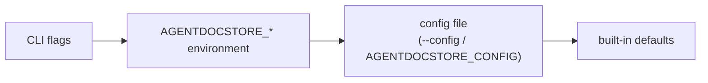

# Configuration

AgentDocStore reads its settings from four layers. The first layer that sets a
value wins:



## Settings

| Setting          | Flag                        | Environment                      | Config key         | Default                 |
| ---------------- | --------------------------- | -------------------------------- | ------------------ | ----------------------- |
| Port             | `--port`                    | `AGENTDOCSTORE_PORT`             | `port`             | `8787`                  |
| Bind address     | `--host`                    | `AGENTDOCSTORE_HOST`             | `host`             | `127.0.0.1`             |
| Data directory   | `--data`                    | `AGENTDOCSTORE_DATA_DIR`         | `dataDir`          | `~/.agentdocstore/data` |
| Auth mode        | `--auth`                    | `AGENTDOCSTORE_AUTH`             | `auth`             | `single-user`           |
| Runtime mode     | `--offline` / `--networked` | `AGENTDOCSTORE_MODE`             | `mode`             | `offline`               |
| Inbound exposure | `--expose`                  | `AGENTDOCSTORE_EXPOSE`           | `expose`           | `false`                 |
| Provider         | `--provider`                | `AGENTDOCSTORE_PROVIDER`         | `provider`         | `fs`                    |
| Provider options | `--provider-options <json>` | `AGENTDOCSTORE_PROVIDER_OPTIONS` | `provider.options` | `{}`                    |
| Single user name | `--user`                    | `AGENTDOCSTORE_USER`             | `user`             | OS login                |
| Token map file   | `--tokens`                  | `AGENTDOCSTORE_TOKENS`           | `tokens`           | —                       |
| Identity header  | `--trusted-header`          | `AGENTDOCSTORE_TRUSTED_HEADER`   | `trustedHeader`    | `x-forwarded-user`      |
| In-memory store  | `--ephemeral`               | `AGENTDOCSTORE_EPHEMERAL`        | `ephemeral`        | `false`                 |
| Config file      | `--config`                  | `AGENTDOCSTORE_CONFIG`           | —                  | —                       |

Boolean environment variables accept `1` or `true`. An unknown auth mode, from
any layer, stops startup with an error naming where it came from: falling back
to the default would leave the instance unauthenticated. So does a port that is
not a whole number from 0 to 65535 (`0` picks any free port). An unrecognised
`AGENTDOCSTORE_MODE` is ignored and the next layer applies (at worst, offline),
so check the boot banner to confirm what you got.

## Config file

```json
{
  "port": 8787,
  "host": "0.0.0.0",
  "expose": true,
  "dataDir": "/var/lib/agentdocstore",
  "auth": "token",
  "tokens": "/etc/agentdocstore/tokens.json",
  "provider": { "module": "fs", "options": {} }
}
```

- Paths are used as written. `~` is **not** expanded — use absolute paths.
- `provider` may be a string (`"fs"`, `"memory"`, or a module specifier) or an
  object `{ "module": "...", "options": { ... } }`.

## Runtime mode and exposure

| Setting  | Controls                                   | Default in effect                         |
| -------- | ------------------------------------------ | ----------------------------------------- |
| `mode`   | Outbound egress and which providers load   | `offline` — fuse armed, local stores only |
| `expose` | Whether a non-loopback `host` is permitted | off — loopback only                       |

In offline mode a non-loopback `host` without `expose` refuses to start, and a
provider declaring `requiresNetwork: true` refuses to load. Both errors name the
flag that allows the action. See the
[architecture notes](ARCHITECTURE.md#the-network-fuse) for what the fuse covers.

## Authentication

### `single-user` (default)

Every request is the configured `user`, or your OS login. For personal use on
your own machine.

### `trusted-header`

Identity is the value of a header set by a reverse proxy (default
`x-forwarded-user`). A request without it gets `401`.

> [!WARNING]
> The proxy **must** remove this header from incoming client requests.
> Otherwise anyone can set it and become anyone. The server prints a warning at
> startup as a reminder.

### `token`

Clients send `Authorization: Bearer <token>`. Tokens map to users in a JSON
file:

```json
{
  "7d1f…long-random-token…": "alice",
  "b93c…long-random-token…": "bob"
}
```

Start with `--auth token --tokens tokens.json`. The server refuses to start if
the file is missing, is not a JSON object, maps to an empty name, or is empty —
an empty map would reject every caller. Generate tokens with a CSPRNG, for
example `openssl rand -hex 32`, and keep the file readable only by the service
user.

## Provider selection

| Value                           | Store                                            |
| ------------------------------- | ------------------------------------------------ |
| `fs`                            | Files under the data directory (default)         |
| `memory` or `--ephemeral`       | In-memory; lost on exit                          |
| `@scope/package` or `./path.js` | A provider module, resolved from the working dir |

Validate a provider before you point real data at it:

```bash
agentdocstore doctor --provider @scope/package --provider-options '{"url":"…"}'
```

The provider contract is in [PROVIDERS.md](PROVIDERS.md).

## MCP (stdio)

`agentdocstore mcp` accepts `--data`, `--provider`, `--provider-options`,
`--user`, `--ephemeral`, `--networked` and `--config`, with the same meaning as
above. Point it at the same data directory as `serve` to share documents between the
web UI and your AI assistant.
